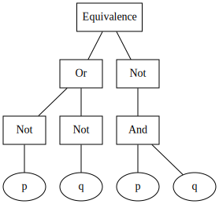

# Logic solver

Experimental interpreter that is able to evaluate propositional logic statements.

```bash
$ echo "~1 v ~0 <=> ~(1 ^ 0)" > statement.prop
$ cargo run statement.prop

Result: "1"
```

## Visualizing AST

It's possible to draw a graphical representation of the Abstract Syntax Tree used
as immediate representation of the statement.

```bash
$ cargo run statement.prop && dot -Tsvg graph.dot -o graph.svg
```

